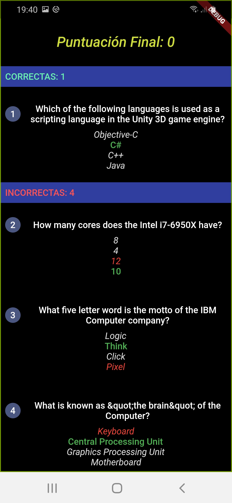
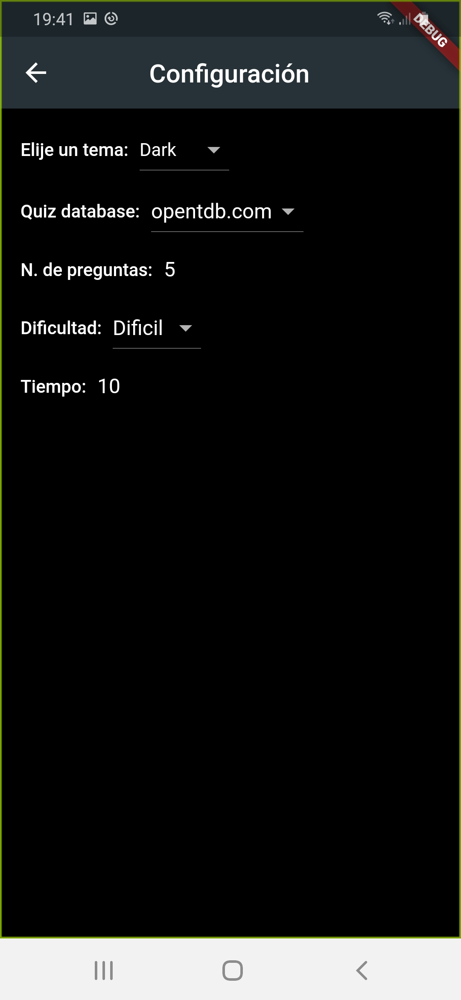

# Bubble Quiz

**características**:

- La gestión del Estado
- Corrientes y patrón BLoC
- Cambiador de tema dinámico
- Página de ajustes
- API de preguntas intercambiables (preguntas de prueba o cuestionario de https://opentdb.com/)
- Datos de Json (búsqueda y análisis)
- Animaciones
- Sombras de texto

### Packages usado:

- [Frideos-flutter](https://pub.dartlang.org/packages/frideos)

## Captura de pantalla

